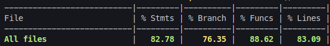
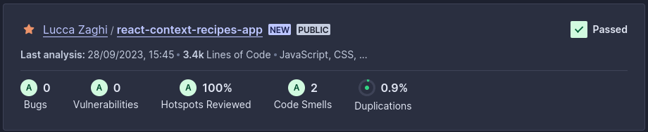

# Recipes App

Essa é uma aplicação React que permite ver, buscar, filtrar, favoritar e acompanhar o progresso de preparação de receitas de comidas e bebidas. <br />
O projeto consome duas APIs públicas, [TheMealDB](https://www.themealdb.com/api.php) e [TheCocktailDB](https://www.thecocktaildb.com/api.php).

O foco desse projeto foi explorar o ecossistema React, especialmente Hooks e ContextAPI.

[Experimente!](react-context-recipes-app.vercel.app/)

## Funcionalidades

- Fazer login
- Recuperar uma lista inicial de comidas ou de bebidas
- Listar receitas por categorias
- Recuperar receitas através de filtros de nome, ingrediente ou primeira letra
- Visualizar os detalhes de uma receita (ingredientes, instruções, vídeo, recomendações)
- Iniciar o preparo de uma receita
- Checklist de preparo de receita salvo automaticamente
- Continuar/finalizar uma receita em andamento
- Favoritar e desfavoritar músicas
- Compartilhar receitas
- Listar receitas finalizadas
- Listar receitas favoritas
- Ver o perfil da pessoa logada
- Fazer o logout


## Demonstração


## Tecnologias utilizadas

React, JavaScript, Bootstrap, API, RTL, LocalStorage


## Instalação local

1. Clone o repositório e entre no diretório
```bash
  git git@github.com:lzaghi/react-context-recipes-app.git
  cd react-context-recipes-app
```

2. Instale as dependências 
```bash
  npm install
```

3. Inicie a aplicação
```bash
  npm start
```

A aplicação estará disponível em ```http://localhost:3000```


4. Para rodar os testes
```bash
  npm run test-coverage
```

## Cobertura de testes



## Qualidade de Código

Análise SonarCloud




